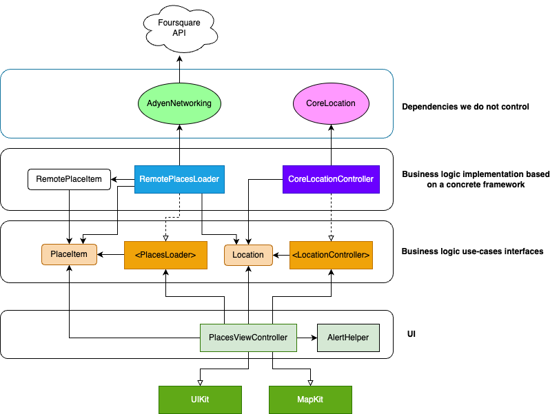

# Requirements

[Assignment description](Assignment.md)

# User story
As a user, I want to see a venues list around my current location.

## Acceptance criteria

Given an online user  
When the user opens the places screen
AND 
the user doesn't have a location tracking permission yet  
Then the iOS location trcking permission request is displayed

Given an online user with a location tracking permission  
When the user opens places screen  
Then the map is displayed with icons on it representing found places within a default radius of 1000m

Given an online user with a location tracking permission and the places screen opened  
When the user adjusts the radius setting  
Then the updated map with new found places is dispalyed

## Assumptions and decisions we can make ourselves

- We do not support offline mode but we build in a way that allows us to use local database or cache in the future.

- We use UIKit for now but we build in a way that allows switching to SwiftUI/AppKit in the future with no changes in the business logic.

- We assume CoreLocation could be unavailable on some platforms

- We will not introduce any specific errors, we will redirect errors from any layer (networking) to the user interface

- We do not need user location for the whole app session so we only receive it once and then stop location tracking to preserve battery life. This could be easily adusted if needed and if new use-cases require that.

- We ask for "when in use" permission from iOS as we do not need to track user location always and we want to build trust

# Use cases

## Obtain current location

### Happy path (permission granted)
1. Sytem checks for location tracking permission status to be "Authorized"
2. System delivers current user location 

### Happy path (no permission granted yet)
1. Sytem checks for location tracking permission status to be "Not determined"
2. System performs OS request for permission with "When in use" level that results in a user seeing the system alert. 
3. User grants permission
4. System delivers current user location

### Sad path (permissions are restricted or denied)
1. System does not use location when performing Foursquare request, relying on its ip-based geolocation detection

## Load places
### Input data
- URL 
- location (latitude, longitude) (Optional)
- radius (Optional)

### Happy path
1. Execute "Load places" command with above data
2. System downloads data from the URL applying optional filters by (latitude, longitude) and radius

### Sad path (no connectivity, server error, invalid data):
1. System delivers error

## UX overview
1. User opens the app that shows "Places" screen right away
2. Places screen has two sections: 
    - a full-screen map (MapKit)
    - a control for adjusting search radius (UISlider)
3. The app shows the map and the icons of places loaded
4. The map is centered on current user location
5. User sees place name under every pin
6. User can see place address by tapping a pin

# Dependency diagram

The architecture of the solution addresses following concerns:
- SOLID principles
- code readability
- scalability

# Potential improvements
1. Testing network layer my mocking responses using `URLProtocol`. 

Examples:
- what apiClient delivers on 200 status code and invalid JSON, etc?
- broken JSON

2. Better network errors handling. `EmptyErrorResponse` error type for `SearchPlacesRequest` doesn't provide a lot of context and `AdyenNetworking` framework itself neither. The next step to improve would be defining minimum set of user-facing errors, checking what kind of errors we receive in real scenario and then adjusting the `handle(:)` method in `RemotePlacesLoader`. This would be a much better way to handle errors and hide their networking-related details behind the predefined text can control and localize.

3. [UX] The map screen user experience could be improved by introducing a circular overlay for the time user interacts with a slider. Map could be also zoomed in/out based on continuous updates from the radius slider.

4. UI part could be decomposed further. The map could be extracted in a separate view controller so it can be reusable component in the future. I believe in the map-based app it could be useful to reduce time to build new features.

5. [UX] Map UX could be improved by introducing custom icons for every place type and custom views to render when user taps place pin. My first idea would be to add tappable phone number so anyone could easily tap it and make a reservation call.

6. [UX] We could open the Apple Maps or Google Maps to help user navigate to selected place.

6. Get rid of storyboards and introduce a factory to instantiate concrete implementations of `LocationController` and `PlacesLoader`, inject dependencies on initialisation to `PlacesViewController`. Concrete types are leaking right now in closures that instantiate necessary remote loader and core location controller. The view controller is implementation-agnostic and can operate with any instance conforming to required interfaces. 
For the sake of not spending too much time on assignment I decided to cut this corner.